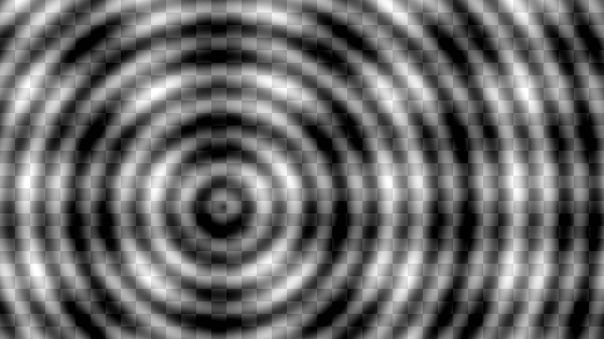

# C 侧阶段 8 板测与连续帧交接（2026-10-03）

阶段 8 的 100 MHz 与 150 MHz 多帧板测、PC 回放和本地证据包均已通过。验证固定使用 B 源提交 `6cc8ea4173d2a720f741e80b7cbd9279558ee93a`、Vivado 2022.2、器件 `xc7a200tfbg484-2` 和完整 C 板级 XDC。

| 多帧候选 | Post-route WNS / TNS | WHS / THS | 板测 |
|---|---:|---:|---|
| 100 MHz | +0.338 / 0 ns | +0.036 / 0 ns | 4 个完整帧逐字节匹配 |
| 150 MHz | +0.423 / 0 ns | +0.036 / 0 ns | 4 个完整帧逐字节匹配 |

每个频点使用帧 ID 0–3 的四个不同 960×540 输入帧，输出各为 1920×1080 灰度 Y；输入每帧 518,400 字节，输出每帧 2,073,600 字节，丢失、重排和字节不匹配均为 0。四帧之间没有人工复位。150 MHz 另有保留 +0.300 ns setup uncertainty 的压力路由报告，WNS 为 +0.123 ns；按正式板级约束恢复后的验收 WNS 为 +0.423 ns。

这组 C 板测使用本机 Vivado 2022.2 和 C 的正式板级约束，与 B 的 Vivado 2025.2 实验 XDC 数据口径不同。B 报告的 +0.492 ns 不替代本次 C 时序结果。100 MHz 与 150 MHz 的静态 ROM 单帧候选也通过官方 A Golden：WNS 分别为 +0.507 ns 和 +0.348 ns。200 MHz 不属于当前验收门槛。

回放文件来自 FPGA 串口实际采集输出，四帧已与两个频点各自的原始回传数据逐字节比对。GIF 在采集完成后生成，每帧显示 500 ms；它不表示实时采集画面或硬件 FPS。主机端四帧收发总耗时约为 100 MHz 113.645 s、150 MHz 113.676 s，包含 UART 输入与输出等待，不作为 CNN 计算周期或 FPS 指标。

完整可复核证据包为 [`experiments/c_side_stage8_20261003/evidence_bundle.zip`](../experiments/c_side_stage8_20261003/evidence_bundle.zip)，包含四个静态/多帧 bitstream、板卡原始采集、仿真与 Vivado 报告、RTL/XDC/构建脚本和逐文件 SHA-256 清单。ZIP SHA-256：`78368f881a288b74c1d04e9e02f14ea702a845a868012b86b091b8c9f244862d`；解压后约 143.0 MB，265 个文件。逐成员哈希及 ZIP CRC 校验已通过。清单见 [`evidence_bundle_manifest.json`](../experiments/c_side_stage8_20261003/evidence_bundle_manifest.json)。

物理断电/按钮复位专项、硬件侧 CNN 计算与 stall 周期计数、Camera/HDMI 尚未覆盖；板级调试端口没有暴露错误计数器。这些边界在证据包的交接 README 和 manifest 中保留说明。原 C checkout 的既有修改与暂存区单独保全，没有混入此交接提交。
