
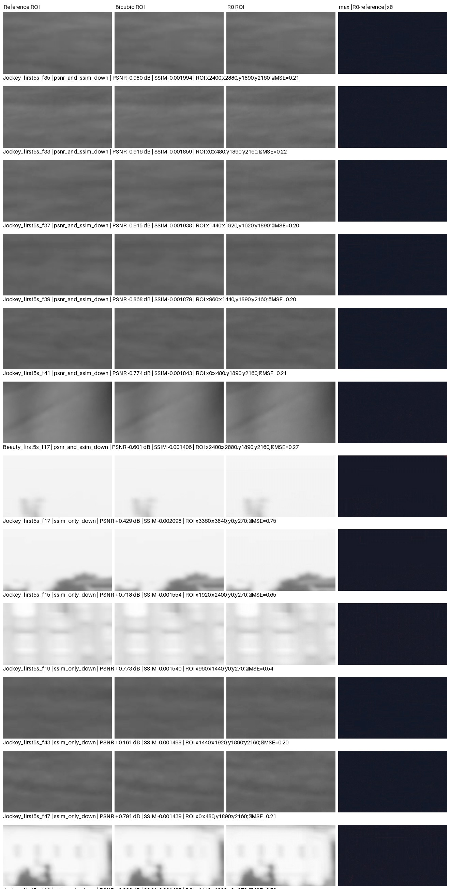

# 成员 A：视频退化帧诊断与彩色软件演示

日期：2026-10-06

状态：PC 软件分析完成；没有修改冻结模型，也不代表 FPGA、HDMI 或板级验收。

## 1. 视频退化帧诊断

从已完成的 10 段视频评测中，Beauty 与 Jockey 各抽查 50 帧，共 100 帧。脚本重新解码源 Y 平面、合成 960×540 输入，并重算双三次基线和冻结整数 R0 输出；所有失败帧的输入、基线和 R0 SHA-256 都与原评测逐帧相同。诊断只分析已有结果，不更改权重或重新选择模型。

| 序列 | 帧数 | PSNR 与 SSIM 均下降 | 仅 SSIM 下降 | 均未下降 | 平均 PSNR 增益 | 平均 SSIM 差值 |
| --- | ---: | ---: | ---: | ---: | ---: | ---: |
| Beauty | 50 | 8 | 16 | 26 | +0.154 dB | +0.001107 |
| Jockey | 50 | 9 | 31 | 10 | +0.518 dB | −0.000663 |
| 合计 | 100 | 17 | 47 | 36 | — | — |

因此，64 个触发帧由 17 个“双指标下降”帧和 47 个“仅 SSIM 下降”帧组成；没有仅 PSNR 下降的帧。Jockey 的片段平均 PSNR 虽然提高，但平均 SSIM 小幅下降，且 50 帧中有 40 帧 SSIM 差值为负。

### 内容特征观察

特征在同一帧参考 Y 的合成 960×540 图上计算：梯度 L1 表示相邻像素亮度差，high-frequency L1 表示图像与 sigma=1 高斯低通结果的绝对差，motion MAE 表示当前帧与前一个 10 fps 采样帧的平均亮度差。以下是描述性统计，单位为 8-bit Y 灰度级：

- 17 个 PSNR 与 SSIM 均下降帧的平均梯度为 1.443、高频残差为 0.756；36 个无回退帧分别为 2.542 和 1.412。该小样本中，回退更常发生在低对比、低纹理帧，但不能据此认定模型根因。
- 47 个仅 SSIM 下降帧的平均参考帧间 MAE 为 23.049，高于无回退帧的 15.008；这些帧的平均 PSNR 仍提高 0.591 dB，而 SSIM 平均下降 0.000728。
- 在 50 帧序列内，参考梯度/高频特征与 PSNR 增益的 Pearson 相关系数，Beauty 分别为 0.194/0.201，Jockey 为 0.782/0.783；motion MAE 与 PSNR 增益的相关系数分别为 0.262/0.507。两段片段的关系明显不同，相关性不能证明因果，也不能单独解释 SSIM 回退。

全局残差放大图用于定位视觉差异，并非原像素强度展示。裁剪 ROI 通过网格比较 R0 与双三次的局部平方误差差值选取；它是“相对较差区域”的筛查结果，不是缺陷定位结论。





机器可读的[逐帧特征与指标](../results/r0_failure_diagnosis_20261006/per_frame_features.csv)和[分组汇总](../results/r0_failure_diagnosis_20261006/diagnostics_summary.json)保留了全部 100 帧。可视化包含全部 64 个退化帧，并放大展示 PSNR 最差的 6 帧及 SSIM-only 最差的 6 帧。

## 2. 彩色视频软件演示

使用公开 UVG Beauty 片段制作了 5 秒、10 fps 的三栏彩色对照视频。左栏是解码的 4K 参考；中栏是 Y 直接双三次 ×4 与软件插值 Cb/Cr；右栏是冻结整数 R0 对 Y 的 ×4 重建与同一路径的插值 Cb/Cr。每栏显示为 640×360 预览，整段视频尺寸为 1920×396。

- 输入是从同一源片段合成的 960×540 Y，以及模拟 540p 4:2:0 输入的 480×270 Cb/Cr。
- R0 处理仅作用于 Y；Cb/Cr 由 Pillow BICUBIC 从 480×270 放大到 4K 输出的 1920×1080 色度网格，再用于软件预览。基线和 R0 使用相同色度路径。
- RGB 预览采用固定 BT.709 全范围转换。它用于说明“亮度超分 + 软件色度插值”的流程，不是完整分辨率色彩画质评分，也不是最终板卡色彩链路。
- 50/50 帧的源 Y、合成 LR Y、双三次 Y 与 R0 Y 哈希均与先前冻结的 4K 评测一致。

交付文件：[彩色视频](../results/r0_color_demo_20261006/demo_beauty_color_5s_10fps.mp4)、[素材与模型哈希清单](../results/r0_color_demo_20261006/color_demo_manifest.json)、[逐帧色度和亮度哈希](../results/r0_color_demo_20261006/per_frame_color_hashes.csv)。演示视频 SHA-256：`0bfdd6911c9409d3b2c946a46cfb34cf08a3550ef4cd7bf99292e8d2225959af`。

该演示使用的 UVG 数据源为 [CC BY-NC 非商业许可](https://ultravideo.fi/dataset.html)，来源文件 Beauty 的 SHA-256 为 `88af90a616635b1a8b726d0260d724da9f662aaf321e5c376eab9ed8ce1eed7f`。保留 A. Mercat、M. Viitanen、J. Vanne，ACM MMSys 2020 引用；原始视频不在仓库中。

## 复现

先按[评测协议](MEMBER_A_R0_4K_INTEGER_QUALITY_PROTOCOL_2026-10-06.md)安装 `quality` 与 `test` 依赖并准备被忽略的 `.data/` 公共素材，再从仓库根目录运行：

```powershell
python -m experiments.r0_4k_quality_20261006.diagnose_failures
python -m experiments.r0_4k_quality_20261006.color_demo
python -m pytest tests\test_r0_4k_quality_eval.py
```

失败分析会在结果目录不存在时创建新结果；已有完整分析可运行 `diagnose_failures --finalize-existing` 更新统计，或运行 `diagnose_failures --refresh-visuals` 重新核验哈希并重绘对照图。彩色视频脚本默认输出 50 帧，`--frame-count` 可缩短为冒烟检查。

## 结论边界

本轮结果支持继续排查 Beauty 的少量 PSNR/SSIM 双降帧和 Jockey 的 SSIM 回退；当前数据还不能证明由运动、纹理、量化或色度中的哪一项导致。R0 权重和量化参数保持不变。视频面板不是原生 4K 输出文件，色度插值也没有板级实现证据。彩色视频、离线指标和内容特征均不证明实时帧率、FPGA bitstream、HDMI 或摄像头链路正确。
